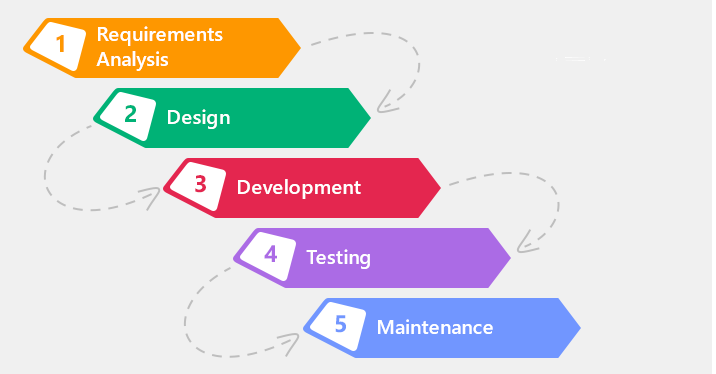

# Model *Waterfall*
  
Sumber : [Dimas Rizky](https://medium.com/dot-intern/sdlc-metode-waterfall-5ae2071f161d)

## 1. Pengertian Model *Waterfall*
Model *Waterfall* adalah metode pertama yang banyak digunakan dalam industri perangkat lunak. Metode ini merupakan pendekatan tradisional dan jauh kurang fleksibel dari pada metodologi terbaru yang mana metodologi tersebut mengandalkan *feedback* dari pengguna. Sesuai namanya, metode ini berkembang secara sistematis dari satu tahap ke tahap lain layaknya air terjun. Pada metode ini, pengerjaannya harus dilakukan secara berurutan yang dimulai dari tahap perencanaan konsep, *design*, implementasi, pengujian, dan pemeliharaan.

## 2. Tahapan Model *Waterfall*
  1. ***Requirement analysis***  
  Pada tahap ini pengembang sistem diperlukan suatu komunikasi yang bertujuan untuk memahami *software* yang dibutuhkan pengguna dan batasan *software*. Informasi ini biasanya dapat diperoleh melalui wawancara, survey atau diskusi.

  2. ***System design***  
  Pada proses desain, dilakukan penerjemahan syarat kebutuhan ke sebuah perancangan desain perangkat lunak yang dapat diperkirakan sebelum dibuatnya proses pengkodean (*coding*). Proses ini berfokus pada struktur data, arsitektur perangkat lunak, representasi *interface*, dan detail algoritma prosedural.  
  Berikut beberapa contoh alat desain sistem:  
    - [*Data Flow Diagram* (DFD)](https://glints.com/id/lowongan/dfd-adalah/#.YVZ3kJpByHs)  
    - [*Flowchart*](https://www.dicoding.com/blog/flowchart-adalah/)  
    - [*Mind Map*](https://www.gramedia.com/best-seller/pengertian-mind-mapping/)  
    - [*Entity Relationship Diagram* (ERD)](https://www.dewaweb.com/blog/entity-relationship-diagram/)  
    - [*Context Diagram*](https://anaktik.com/diagram-konteks/)  

  3. ***Implementation***  
  Pada tahap ini terjadi proses menerjemahkan perancangan desain ke bentuk yang dapat dimengerti oleh mesin, dengan menggunakan kode-kode bahasa pemrograman. Kode program yang dihasilkan masih berupa modul-modul kecil yang nantinya akan digabungkan pada tahap berikutnya.

  4. ***Integration & Testing***  
  Di tahap ini dilakukan penggabungan modul-modul yang sudah dibuat dan dilakukan pengujian ini dilakukan untuk mengetahui apakah software yang dibuat telah sesuai dengan desainnya dan fungsi pada *software* terdapat kesalahan atau tidak.

  5. ***Operation & Maintenance***  
  Ini merupakan tahap terakhir dalam model waterfall. Software yang sudah jadi dijalankan serta dilakukan pemeliharaan. Pemeliharaan termasuk dalam memperbaiki kesalahan yang tidak ditemukan pada langkah sebelumnya. Perbaikan implementasi unit sistem dan peningkatan jasa sistem sebagai kebutuhan baru.

## 3. Kelebihan Model *Waterfall*
  - *Waterfall* adalah metode pengembangan paling handal dan paling lama digunakan.
  - Cocok untuk sistem *software* dengan kompleksitas rendah (*predictable*).
  - Pengerjaan *project* sistem akan terjadwal dengan baik dan mudah dikontrol.

## 4. Kekurangan Model *Waterfall*
  - Waktu pengembangan lama karena harus menunggu tahap sebelumnya selesai.
  - Dikarenakan waktu pengembangan lama, maka biayanya juga mahal.
  - Tidak cocok dengan sebuah proyek yang memiliki kompleksitas tinggi.

[Kembali](README.md)