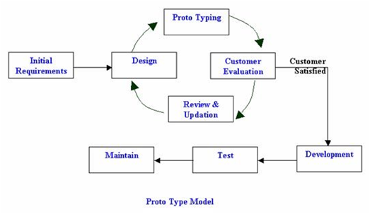

# Model *Prototype*
  
Sumber : [shydestinydeer](http://shydestinydeer.blogspot.com/2017/04/sdlc-dengan-metode-prototype.html)

## 1. Pengertian Model *Prototype*
Model *Prototype* adalah salah satu metode pengembangan *software* yang mengijinkan pengguna memiliki gambaran awal tentang progam yang akan dikembangkan serta melakukan pengujian awal. Metode ini menyajikan gambaran yang lengkap dari suatu sistem perangkat lunak, terdiri atas model kertas, model kerja dan program. Pihak pengembang akan melakukan identifikasi kebutuhan pemakai, menganalisis sistem dan melakukan studi kelayakan serta studi terhadap kebutuhan pemakai, meliputi model interface, teknik prosedural dan teknologi yang akan dimanfaatkan. Setelah gambaran awal disepakati, pengembang baru akan membuat produk aslinya sebagai hasil akhir dari proyek. Oleh karena itu sistem akan dikembangkan lebih cepat daripada tradisional dan biayanya menjadi lebih rendah. 

## 2. Tahapan Model *Prototype*
  1. **Pengumpulan kebutuhan**  
  Pengguna dan pengembang bersama sama mendefinisikan format seluruh perangkat lunak, semua kebutuhan, dan garis besar sistem yang akan dibuat.

  2. **Membangun *Prototype***  
  Dengan membuat perancangan sementara yang berfokus pada penyajian kepada pengguna (Misal membuat input dan format output).

  3. **Evaluasi *Prototype***  
  Evaluasi ini dilakukan oleh pengguna, jika sudah sesuai maka langkah selanjutnya akan diambil. Namun jika belum sesuai maka *prototype*-nya direvisi dengan mengulang langkah-langkah sebelumnya.

  4. **Mengkodekan Sistem**  
  Dalam tahap ini *prototype* yang sudah disepakati diterjemahkan kedalam bahasa pemograman yang sesuai.

  5. **Menguji Sistem**  
  Setelah sistem menjadi suatu perangkat lunak, kemudian dilakukan proses pengujian.

  6. **Evaluasi Sistem**  
  Pengguna akan mengevaluasi apakah perangkat lunak sudah jadi dan sudah sesuai yang diharapkan. Jika sudah maka proses akan dilanjutkan ke tahap selanjutnya, namun jika belum maka mengulang tahap sebelumnya.

  7. **Menggunakan Sistem**  
  Perangkat lunak yang telah diuji dan diterima pengguna siap untuk digunakan.

## 3. Kelebihan Model *Prototype*
  - Penentuan kebutuhan lebih mudah untuk diwujudkan.
  - Mempersingkat waktu pengembangan.
  - Pengembang dapat bekerja lebih baik dalam menentukan kebutuhan pengguna sistem.
  - Adanya komunikasi yang baik antar pengembang dan pengguna.

## 4. Kekurangan Model *Prototype*
  - Proses analisa dan perancangan terlalu singkat.
  - Biasanya kurang fleksibel dalam menghadapi perubahan.

[Kembali](README.md)