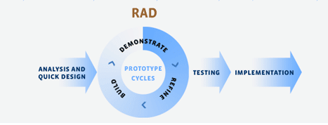

# Model RAD (*Rapid Application Development*)
  
Sumber : [Dede Kurniadi](https://www.researchgate.net/figure/Gambar-1-Rapid-Application-Development-RAD_fig5_314551718)

## 1. Pengertian Model RAD (*Rapid Application Development*)
Model RAD (*Rapid Application Development*) adalah strategi siklus hidup yang ditujukan untuk menyediakan pengembangan yang jauh lebih cepat dan mendapatkan hasil dengan kualitas yang lebih baik dibandingkan dengan hasil yang dicapai melalui siklus tradisional [(McLeod, 2002)](https://www.amazon.com/Systems-Development-Project-Management-Approach/dp/0471220892). RAD merupakan gabungan dari bermacam-macam teknik terstruktur dengan teknik *prototyping* dan teknik pengembangan *joint application* untuk mempercepat pengembangan sistem atau aplikasi [(Bentley, 2004)](https://www.amazon.com/Systems-Analysis-Methods-Jeffrey-Whitten/dp/0072474173). Dari definisi-definisi konsep RAD ini, dapat dilihat bahwa pengembangan aplikasi dengan menggunakan metode RAD ini dapat dilakukan dalam waktu yang relatif lebih cepat. Selain waktu yang relatif cepat, metode ini juga dapat menekan biaya lebih rendah, namun pengembang harus memiliki kemampuan untuk menyesuaikan diri dengan cepat.

## 2. Tahapan Model RAD (*Rapid Application Development*)
  1. ***Requirement planning***  
  Dalam tahap ini diketahui apa saja yan menjadi kebutuhan sistem yaitu dengan mengidentifikasikan kebutuhan informasi dan masalah yang dihadapi untuk menentukan tujuan, batasan-batasan sistem, kendala dan juga alternatif pemecahan masalah. Analisis digunakan untuk mengetahui perilaku sistem dan juga untuk mengetahui aktivitas apa saja yang ada dalam sistem tersebut.

  2. **Membuat *prototype***  
  Para pengembang mulai membuat prototipe secara cepat, dengan fitur dan fungsi yang dibutuhkan. Setelah itu, prototipe akan diberikan kepada pengguna untuk mengetahui apa *feedback* dari mereka.

  3. ***Rapid construction* dan pengumpulan *feedback***  
  Setelah menerima cukup *feedback* dari pengguna, prototipe akan dikembangkan lagi hingga pengguna memberikan persetujuan untuk finalisasi produk. Tahap 2 dan 3 akan terus diulang hingga hasilnya sesuai apa yang diinginkan oleh pengguna.

  4. **Implementasi**  
  Fitur, fungsi, visual, dan *interface* akan diulas kembali oleh pengguna. Pada tahap ini, uji coba akan dilakukan jika memang dibutuhkan. Uji cobanya mencakup kestabilan, *usability testing*, dan pengujian lainnya untuk memastikan semua hal sudah terkontrol.

## 3. Kelebihan Model RAD (*Rapid Application Development*)
  - Mudah untuk diamati karena menggunakan model prototype, sehingga pengguna lebih mengerti akan sistem yang dikembangkan.
  - Lebih fleksibel karena pengembang dapat melakukan proses desain ulang pada saat yang bersamaan.
  - Keterlibatan pengguna semakin meningkat karena merupakan bagian dari tim secara keseluruhan.
  - Mempercepat waktu pengembangan sistem secara keseluruhan karena cenderung mengabaikan kualitas.

## 4. Kekurangan Model RAD (*Rapid Application Development*)
  - Lebih banyak terjadi kesalahan apabila hanya mengutamakan kecepatan dibandingkan dengan biaya dan kualitas.
  - Kesulitan melakukan pengukuran mengenai kemajuan proses.
  - Ketelitian menjadi berkurang karena tidak menggunakan metode yang formal dalam melakukan pengkodean.
  - Fasilitas-fasilitas banyak yang dikurangi karena terbatasnya waktu yang tersedia.

[Kembali](README.md)