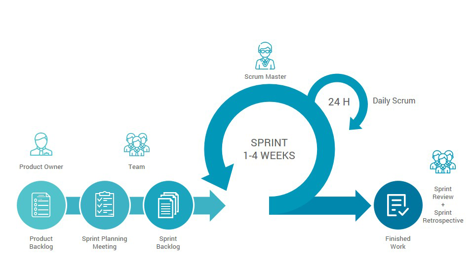

# Model *Scrum*
  
Sumber : [Izzatul Muttaqin](https://medium.com/ppl-c6-big-data/ppl-6-0-week-3-4-scrum-ad0c8341a5c9)

## 1. Pengertian Model *Scrum*
Model *Scrum* adalah salah satu metode rekayasa *software* yang menggunakan prinsip *Agile*, yang mengacu kepada kekuatan kolaborasi tim, *incremental product* dan proses iterasi untuk mencapai tujuan/produk. Scrum merupakan sebuah kerangka kerja yang menggunakan bermacam proses dan teknik. *Scrum* mengurangi ketidakefektifan dari manajemen produk dan teknik kerja sehingga dapat meningkatkan kinerja produk, tim, dan lingkungan kerja.

## 2. Tahapan Model *Scrum*
  1. ***Product backlog***  
  Semua anggota tim terlibat dalam proses product backlog. Tahap ini bertujuan untuk mengumpulkan daftar persyaratan proyek tentang deskripsi singkat fungsionalitas yang diinginkan dari sebuah produk. Setelah tujuan itu diketahui kemudian dibagi menjadi bagian-bagian kecil yang memiliki nilai dan layak dikembangkan. Biasanya pemilik proyek akan menentukan skala prioritas dalam pengerjaan bagian-bagian terkecil tersebut yang menghasilkan *to do list*. 

  2. ***Backlog refinement***  
  Product backlog tadi harus diperhatikan oleh tim *Scrum* untuk dilakukan perencanaan. Tak heran hal-hal yang harus diperhatikan dalam proses ini yaitu melakukan *breakdown* kebutuhan dan proses estimasi penghalusan *backlog refinement* sambil membuat perencanaan *sprint*.

  3. ***Sprint planning meeting***  
  Proses *sprint planning* menjadi yang terpenting sebelum menjalankan suatu *sprint*. *Sprint* dapat diilustrasikan sebagai kotak waktu dengan durasi satu hingga empat pekan. Dalam jangka waktu ini, para pengembang fokus mencapai target tertentu. Pada fase ini semua tim berkumpul untuk mengidentifikasi tugas masing-masing. Selain itu, jadwal rilis dari masing-masing tim pun dibicarakan di sini.

  4. ***Daily scrum***  
  Tahap *Scrum* ini bisa dikatakan sebagai evaluasi, karena para anggota tim menyampaikan update pekerjaan harian masing-masing. Berbagai kendala pun bisa didiskusikan di sini. Proses *daily scrum* ini dijalankan setiap hari, selama *sprint* berlangsung.

  5. ***Sprint review meeting***  
  Dalam tahapan ini, setiap anggota tim mendemonstrasikan yang sudah diselesaikan dalam periode satu *sprint*. Dengan kata lain, *sprint* review ini dilakukan setiap satu *sprint* selesai.

  6. ***Sprint retrospective***  
  Pada setiap *sprint* yang berakhir, akan ada *sprint restrospective*. Semua anggota tim bisa menyampaikan pendapat dan evaluasi mengenai kinerja selama menerapkan *Scrum*. Namun, hal-hal teknis dari proyek yang digarap, tidak ikut dibahas di sini. 

## 3. Kelebihan Model *Scrum*
  - Pembangunan sistem dapat lebih cepat.
  - Mengurangi risiko gagal implementasi software dari segi non-teknis.
  - Mengurangi kerugian dari segi materi apabila terjadi kegagalan saat pembangunan sistem.
  - Sistem kerja lebih efektif karena adanya *daily report* yang berisi laporan progress pengerjaan dari masing-masing divisi secara berkala dan update.

## 4. Kekurangan Model *Scrum*
  - Keseluruhan tim *Scrum* harus memiliki skill yang setara dan berkomitmen agar dapat berjalan dengan lancar.
  - *Meeting* setiap hari dapat membuat tim kelelahan.
  - Tidak cocok untuk proyek yang memiliki kompleksitas tinggi.

[Kembali](README.md)